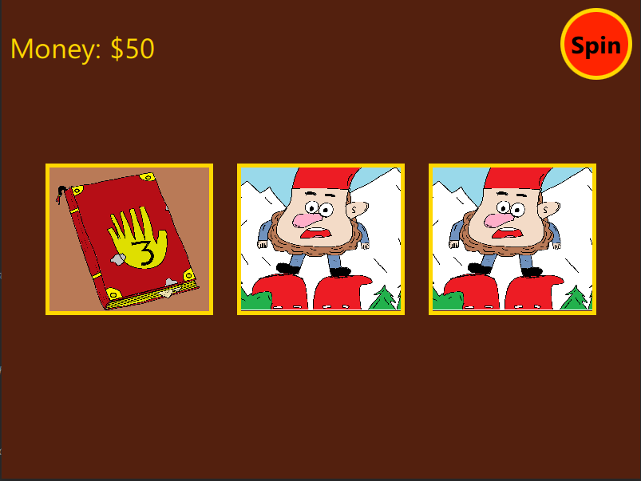
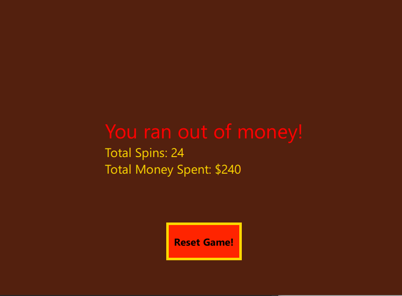

# Slots-Rosvopeli

Small slots ( Yksikätinen rosvo ) game made with qml / javascript. 

It has fun qml animations and oc art drawn in ms paint. 

Game mimics slots machine look and the art is Gravity Falls themed.

This is propably never gonna get updated! It was a fun project to learn qml.

### Spin the wheel and win 

- Spin the wheel and hopefully win 

- Every spin costs 10$

- You can win 10$-50$

- Try to spin as many times as money lasts

### Few pictures

#### Notes for future

> Propably should have made the game logic with c++
> 
> Or atleast split in to separate files did not realize this was gonna be 400 lines :P
